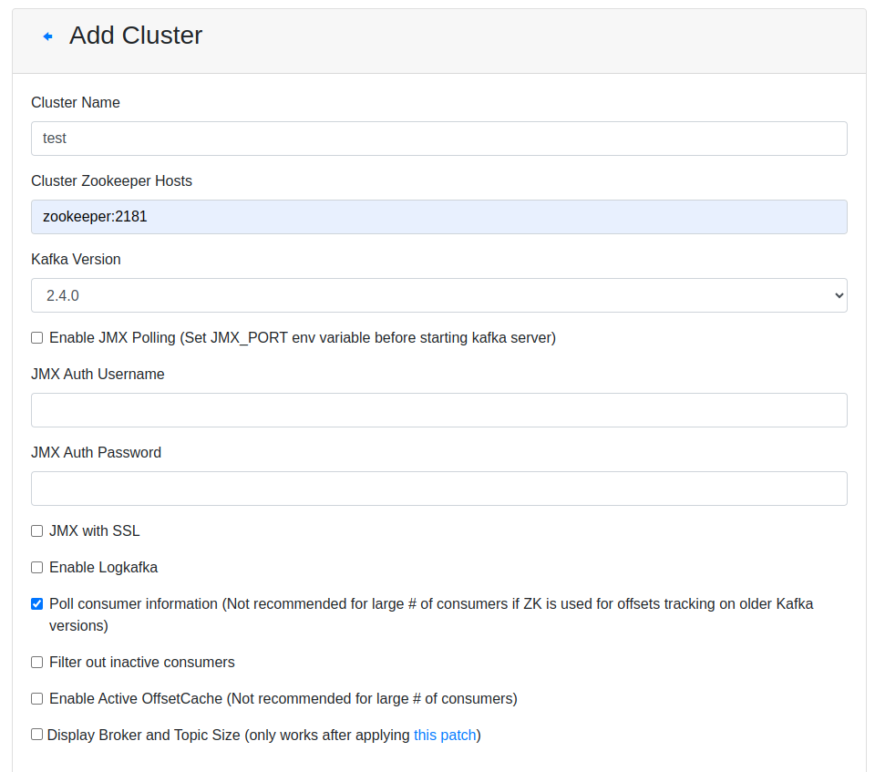
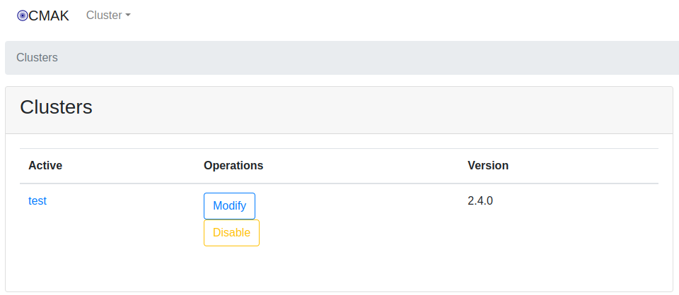
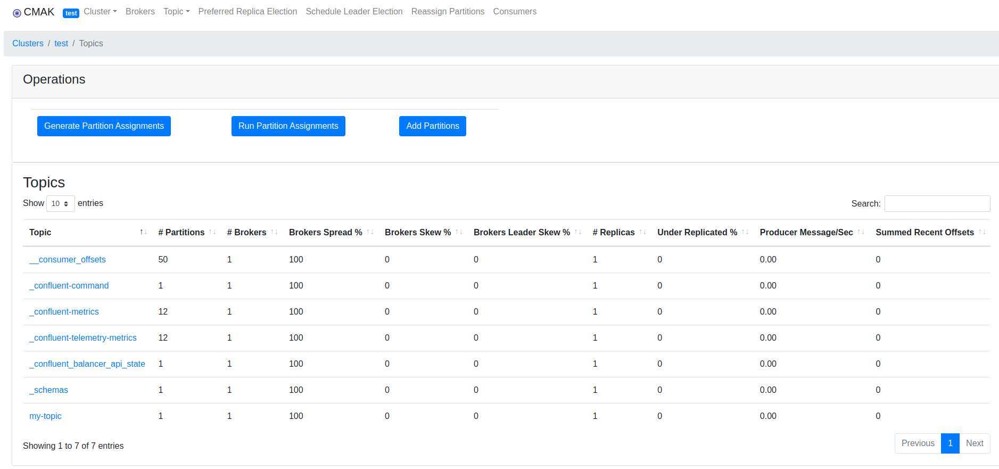

# Apache Kafka Docker Usage Guide

This README file explains step by step how to start Apache Kafka using Docker.

## Prerequisites

- Docker is a Containerization Platform; it enables us to containerize an application or software (referred to as a Docker Image) and also allows us to run the containerized application/software.

- Make sure Docker is installed on your computer. You can [download Docker here](https://www.docker.com/get-started).


## Starting Apache Kafka - ZooKeeper - UI

### **1. Clone this repository:**

   ```bash
   git clone https://github.com/ramazanakkulak/apache-kafka-docker
   ```

### **2. Run docker-compose:**
   - For the case with source control
   ```bash
   docker-compose docker-compose-resource-control.yml up
   ```

   - For the case without source control
   ```bash
   docker-compose up
   ```

### **3. Kafka Manager**

   - You can [reach Kafka Manager here](http://localhost:9000).

   ##### Settings for Kafka Manager
   **1.** Fill in Relevant Sections
   - Make sure to complete the relevant sections as shown below:

   

   <br>

   **2.** Save Without Modifying Other Sections 
   - Save the settings without making any changes to the other sections.

   
   
   <br>

   **3.** View Topic List in the Final Section
   - In the final section, you will be able to see the list of relevant topics.

   


### **4. Test**
   ##### Elevating Efficiency: Virtual Development Environments on Production Servers

   - In the dynamic sphere of software development, adopting virtual development environments within production servers presents a savvy approach compared to relying solely on primary development setups. The advantage is clear: these virtual realms allow code manipulation without jeopardizing main development files.

   - This approach is highly flexible, allowing the creation of multiple distinct virtual environments, each housed in separate directories on the server. These environments come to life through the venv (virtual environment) package, ensuring organized and controlled development spaces.

   - In essence, integrating virtual development environments within production servers is a prudent choice. It safeguards code integrity, supports diverse environments, and streamlines development processes, all orchestrated through the venv package.

   The virtual environment is deployed using the installed venv (virtual environment) package:


   ```bash
   sudo apt install python3-venv
   ```

   Change to the first directory and use the following command to create a virtual environment called venv:

   ```bash
   python3 -m venv venv
   ```

   The generated files configure the virtual environment to work separately from our host files. Activation of the environment is as follows, and to disable the environment, you must run the deactivate command:

   ```bash
   source venv/bin/activate
   ```
   <br>
   Let's install the packages related to the virtual environment.

   ```bash
   pip install -r requirements.txt
   ```

   ##### Producer

   ```bash
   cd producer
   python3 producer.py
   ```

   ##### Consumer

   - In Kafka, the terms "latest" and "earliest" refer to two different starting points used in data consumption:

   - Latest: When a Kafka consumer is started with "latest," it retrieves the most recent data from that point forward. In other words, the consumer processes data that has been added to the Kafka queue after its initiation.

   - Earliest: When a Kafka consumer is started with "earliest," it retrieves all data starting from the oldest available data in the Kafka queue. This option gives the consumer an opportunity to process all data in the Kafka queue.

   - These starting points are used to define the data consumption behavior of a consumer application. The "latest" option is usually preferred for scenarios where working with the most recent data is important, while the "earliest" option is used in scenarios where processing data from a broader time range is required.

   ```bash
   cd consumer
   python3 consumer-earliest.py 
   ```

   ```bash
   cd consumer
   python3 consumer-latest.py 
   ```

   